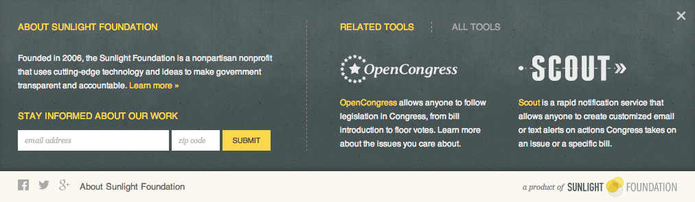
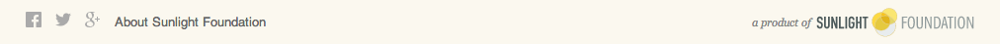

# Sunlight Branding Bar

The branding bar for Sunlight's tools and projects sits at the top of each site, and includes social media icons, an "About Sunlight" panel, and the Sunlight Foundation logo.



## Install

1. Include minified CSS and javascript for the branding bar from the Sunlight CDN. The current version is `0.1.1`
    
    CSS should be dropped inside your head tag:
    
    ```html
    <link rel="stylesheet" href="https://sunlight-cdn.s3.amazonaws.com/brandingbar/0.1.1/css/brandingbar.css">
    ```

    Javascript should be dropped in after your page content, usually at the bottom of the page:
    
    ```html
    <script src="https://sunlight-cdn.s3.amazonaws.com/brandingbar/0.1.1/js/brandingbar.min.js.gz"></script>
    ```
    

2. Include the icon font [SF Icons](https://github.com/sunlightlabs/sf-icons):

    ```html
    <link rel="stylesheet" href="http://sf-icons.s3.amazonaws.com/css/sf-icons.css">
    ```
    If IE8 support is needed, include the following javascript at the bottom of your page as well :
    
    ```html
    <!--[if IE 8]>
        <script src="http://sf-icons.s3.amazonaws.com/js/sf-icons.js"></script>
    <![endif]-->
    ```
    
    
    
## Usage

First, add the class `bb_wrapper` to your html tag:

```html
<html class="bb_wrapper">
```


### Quick Setup
Ideal for *new sites* that do not already have a branding bar. This injects the contents of the branding bar from a template and includes default styles.


1. Add this html where you want the branding bar injected (ie. as the first element in the body tag):

    ```html
    <div class="branding-bar" data-bb-brandingbar="true" data-bb-property-id="sunlightlabs-awesome"></div>
    ```
2. Add additional branding styles as needed.


### Custom Branding Bar
For sites that *already* have custom implementations of the branding bar. To avoid conflicts, you'll need to manually include the contents of the branding bar.

1. Add these two data attributes `data-bb-brandingbar="true"` `data-bb-property-id="sunlightlabs-awesome"` to the root element of the existing branding bar.
    
    ```html
    <div class="my-custom-branding-bar" data-bb-brandingbar="true" data-bb-property-id="sunlightlabs-awesome">
        ...
    </div>
    ```

2. Include or replace the contents of the branding bar as needed. Include social media icons, branding bar toggle, and Sunlight logo.
    
    ```html
    <div class="branding-bar_container">
        <div class="branding-bar_links">

            <!-- Social Media Icons -->
            <a class="social" href="https://www.facebook.com/sunlightfoundation"><span class="icon icon-facebook"></span></a>
            <a class="social" href="https://twitter.com/sunfoundation"><span class="icon icon-twitter"></span></a>
            <a class="social" href="https://plus.google.com/+sunlightfoundation"><span class="icon icon-google-plus"></span></a>
            
            <!-- Branding Bar Toggle --> 
            <a class="branding-bar_trigger" data-bb-toggle=".bb_wrapper" href="http://sunlightfoundation.com/about/">About Sunlight Foundation</a>
        </div>
        
        <!-- Sunlight Logo -->
        <div class="branding-bar_logo">
            <span class="branding-bar_productof">a product of </span>
            <a class="branding-bar_sunlight-logo" href="http://www.sunlightfoundation.com">Sunlight Foundation</a>
        </div>
    </div>
    ```

3. To style the contents of the branding bar (based on above html), use css from the [default branding bar stylesheet](https://github.com/sunlightlabs/branding-bar/blob/master/src/css/brandingbar-default.css). You may need to override global styles set by the site's stylesheets.


---

##Tips

#####Fonts: Helvetica and Franklin Gothic
The fallback font for the branding bar is Helvetica and then Arial, but the preferred font is Franklin Gothic. If the site has a Typekit kit, [Franklin Gothic URW, 400](https://typekit.com/fonts/franklin-gothic-urw) can be added as necessary.

#####CSS: To vertically center branding bar content
Set line-height of `.branding-bar_links` and `.branding-bar_logo` equal to the height of the branding bar

## Development

1. Clone this repo.
2. Run `npm install`
3. Run `gulp watch` to start the server and watch for changes.
4. Edit files in the `src` directory to your liking.
5. If there is **any** possibility that the changes you made could break existing implementations,
    you **must** increment the version in [package.json](https://github.com/sunlightlabs/branding-bar/blob/master/package.json).
6. If the version changed, run `gulp` to rebuild the JS, which includes CSS based on the version number.
7. Check in your files, and then tag a release (if the version changed) by running `gulp tag`
8. Push everything to github, and then publish to S3 by running `gulp publish`.
    You will need valid S3 credentials in your aws.json file to do this.

