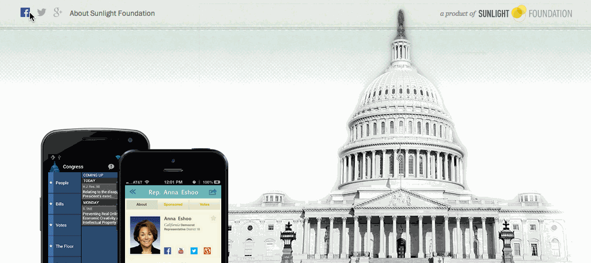

# Sunlight Branding Bar

The branding bar for Sunlight's tools and projects sits at the top of each site. This injects the branding bar and includes default styles.



## Install

**Using Bower**

You can include `'branding-bar': 'sunlightlabs/branding-bar'` in your project's `bower.json` dependencies,
or just `bower install sunlightlabs/branding-bar`

**From CDN**

1. Include minified CSS and javascript for the branding bar from the Sunlight CDN. The current version is `0.3`.

    CSS should be dropped inside your head tag:

    ```html
    <link rel="stylesheet" href="https://sunlight-cdn.s3.amazonaws.com/brandingbar/:version/css/brandingbar.css">
    ```

    Javascript should be dropped in after your page content, usually at the bottom of the page:

    ```html
    <script src="https://sunlight-cdn.s3.amazonaws.com/brandingbar/:version/js/brandingbar.min.js.gz"></script>
    ```


2. Include the icon font [SF Icons](https://github.com/sunlightlabs/sf-icons). The current version is `0.2`.

    ```html
    <link rel="stylesheet" href="https://sunlight-cdn.s3.amazonaws.com/sf-icons/:version/css/sf-icons.css">
    ```
    If IE8 support is needed, include the following javascript at the bottom of your page as well :

    ```html
    <!--[if IE 8]>
        <script src="https://sunlight-cdn.s3.amazonaws.com/sf-icons/:version/js/sf-icons.js"></script>
    <![endif]-->
    ```


## Usage

1. Add the class `bb_wrapper` to your html tag:

    ```html
    <html class="bb_wrapper">
    ```

2. Add this html where you want the branding bar injected (ie. as the first element in the body tag):

    ```html
    <div class="branding-bar" data-bb-brandingbar="true" data-bb-property-id="sunlightlabs-awesome"></div>
    ```
    If a light version of the Sunlight Foundation logo is needed, add this class: `sflogo-light`.

3. Add additional branding styles and fonts as needed.

#####Typography
Include Franklin Gothic. If the site has a Typekit kit, add [Franklin Gothic URW, 400 and 500](https://typekit.com/fonts/franklin-gothic-urw) if those are not already included. The fallback font for the branding bar is Helvetica, then Arial.

#####CSS: To vertically center branding bar content
Set line-height of `.branding-bar_links` and `.branding-bar_logo` equal to the height of the branding bar

---

## Development

1. Clone this repo.
2. Run `npm install`
3. Run `gulp watch` to start the server and watch for changes.
4. Edit files in the `src` directory to your liking.
5. If there is **any** possibility that the changes you made could break existing implementations,
    you **must** increment the version in [package.json](https://github.com/sunlightlabs/branding-bar/blob/master/package.json).
6. If the version changed, run `gulp` to rebuild the JS, which includes CSS based on the version number.
    (This step is only necessary if you have uncompiled changes--any changes made under `watch` have already been built.)
7. Check-in/push your files.
8. Tag a release (if the version changed) by running `gulp tag`.
9. Push your tag: `git push origin --tags`
10. Publish to S3 by running `gulp publish`.
    You will need valid S3 credentials in your aws.json file to do this.

